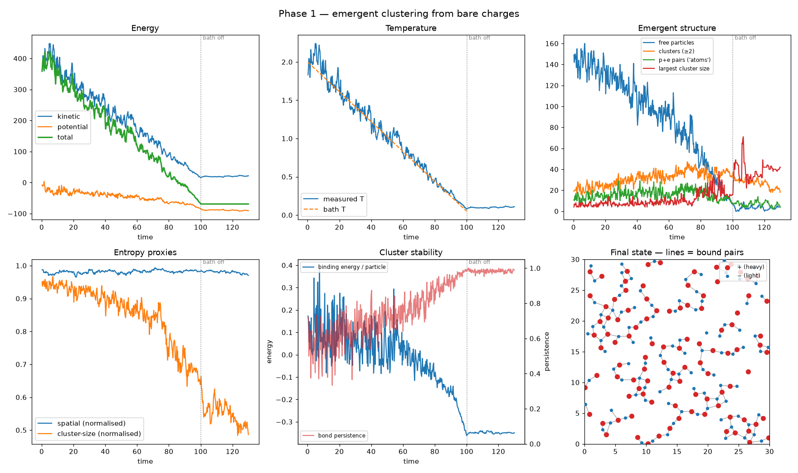
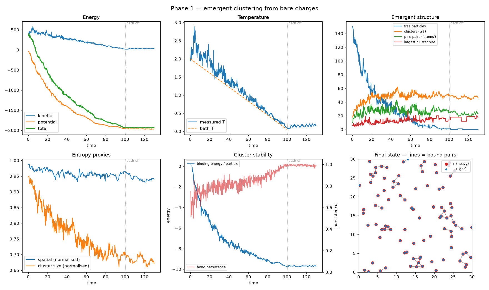

# Emergent — bottom-up particle interaction simulator

Define only fundamental pair rules (charges, masses, force laws) and let
bound structures emerge. Diagnostics measure what forms; an anomaly monitor
flags where the rules or the numerics break down.

```
pip install -r requirements.txt
python run_phase1.py                  # 2D, 200 particles, ~3 min on 1 CPU
python run_phase1.py --dim 3
python run_phase1.py --no-core        # remove the short-range core -> classical collapse
```

Each run writes to `runs/<name>/`: `log.csv` (time series), `anomalies.jsonl`,
`final_state.npz`, and a `report.png` dashboard.

## Replay viewer

`viewer/` is a browser replay of recorded runs: particles, bound pairs,
cluster colouring and synced diagnostic charts. It plays back the Python
output frame by frame; the physics is not re-implemented in JavaScript.

```
python run_phase1.py --out runs/phase1_2d --export viewer/data/with_core.json
python run_phase1.py --no-core --out runs/no_core --export viewer/data/no_core.json
cd viewer && python -m http.server 8000     # then open http://localhost:8000
```

## Results so far

| | With core | Core removed |
|---|---|---|
| Structure | alternating +/− chains and networks (ionic-solid-like) | collapsed tight p+e pairs |
| Isolated-phase energy drift | ~3e-5 | ~1e-2 |
| Anomalies | none | `singularity:close_approach`, `numerical:energy_drift` |




## Architecture

```
            ┌────────────────────── experiment script (run_phase1.py) ─────────────────────┐
            │  species + rules + protocol (anneal → isolated) + seed  = one reproducible run │
            └───────────────────────────────────────┬──────────────────────────────────────┘
                                                    ▼
 state.py          interactions.py        forces.py            integrators.py     boundaries.py
 SoA arrays   ──►  PairInteraction   ──►  DirectForceField ──► LangevinBAOAB  ──► ReflectingBox
 pos/vel/kind      Coulomb, Core,         O(N²) exact; later   γ=0 ⇒ velocity
 mass/charge/…     Yukawa, …(plug-in)     cell list/BH/PME/GPU  Verlet (symplectic)
                                                    │
                                                    ▼
                          sim.py (emergence loop) ──► diagnostics.py (read-only observers)
                                                      energies, T, bound-pair graph, clusters,
                                                      binding energy, persistence, entropy,
                                                      AnomalyMonitor → anomalies.jsonl
```

Design rules:
1. **Physics lives only in `interactions.py`.** Nothing else knows about forces,
   and nothing anywhere mentions atoms or bonds.
2. **Observers never feed back into dynamics.** Diagnostics only measure.
3. **Every backend implements the same `compute(state)`**, so a fast backend can
   always be validated against the exact O(N²) one.
4. **Anomalies are categorised:** `numerical` means the simulator is wrong;
   `singularity` means the rules themselves break down.

## Units

Dimensionless: k = 1, k_B = 1, heavy mass = 10, light mass = 1, |q| = 1.
With the default core (c = 1/8, n = 8) the +/− pair potential has its minimum at
r = 1 with depth −0.875.
