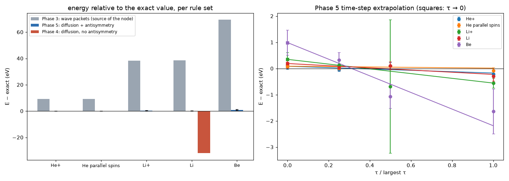

# antisymmetry: findings

Script: `run_antisymmetry.py` · branch `phase5-antisymmetry` · 60 runs, 79 min on 4 cores.
Data: `chunks.csv`, `summary.json`; the unguided first attempt is kept in
`unguided/`. Figure: `python plot_antisymmetry.py`. Units: atomic units, real masses.

## Why this step

Phase 4 (`results/diffusion/FINDINGS.md`) found the exact ground state for
every particle set with at most one electron per spin, but no Pauli
principle. Lithium's three electrons all fell into the innermost region
(32 eV overbound), and H₂ with parallel spins bound like ordinary H₂.
Phase 3's wave packets had Pauli but not correlation.

## The rule (`emergent/antisymmetry.py`)

**Exchanging two identical fermions with the same spin flips the sign of
the wave.** It has no strength and no constant.

In a walker picture, the wave now has positive and negative regions,
separated by a surface where it is zero: the node. Each walker keeps the
sign of the region it is in and may not cross into the other.

**Where the node comes from (the labelled approximation).** The exact node
is unknown. Finding it exactly requires signed walkers that cancel each
other, and in 6–12 dimensions they almost never meet (the fermion sign
problem). The node is therefore taken from the wave that the Phase 3 rules
find on their own from 16 random starts. No atom knowledge enters. For every
system here those packets settled concentrically on the nucleus, so the node
is "two same-spin electrons equally far from the nucleus". A wrong node can
only raise the energy, so every result is an upper bound.

**Guided walkers (numerical, `emergent/guide.py`).** Walkers drift along the
same packet wave, multiplied by the exact pair-cusp factor for every pair
(slope μᵢⱼqᵢqⱼ, a consequence of Coulomb + kinetic energy for any pair). For
a fixed node the guide cannot change the energy, only the noise. A test
checks this: a deliberately poor guide still gives exact helium
(`tests/test_guide.py`).

Constants: ħ, masses, charges, spins. Every particle of every walker starts
at a random point.

## Results

Energies extrapolated to τ → 0 (Hartree), against exact non-relativistic
values for the same particles and masses:

| system | Phase 3 packets | Phase 4 (no antisymmetry) | **Phase 5** | exact | Phase 5 − exact |
|---|---|---|---|---|---|
| He⁺ | −1.659 | — | **−1.9966 ± 0.0041** | −1.99973 | +0.09 eV (0.8σ) |
| He, parallel spins (2³S) | −1.831 | (would give −2.903) | **−2.1716 ± 0.0032** | −2.17493 | +0.09 eV (1.0σ) |
| Li⁺ | −5.867 | — | **−7.2665 ± 0.0099** | −7.27934 | +0.35 eV (1.3σ) |
| Li | −6.062 | −8.651 | **−7.4704 ± 0.0061** | −7.47745 | +0.19 eV (1.2σ) |
| Be | −12.117 | — | **−14.630 ± 0.018** | −14.66646 | +0.99 eV (2.1σ) |

Derived quantities (eV), all from the simulation's own energies:

| quantity | Phase 3 packets | **Phase 5** | measured |
|---|---|---|---|
| He parallel-spin state: ionization | 4.70 | **4.76 ± 0.14** | 4.768 |
| Li ionization | 5.31 | **5.55 ± 0.32** | 5.392 |
| Li total binding | 164.9 | **203.28 ± 0.17** | 203.49 |
| Be total binding | 329.7 | **398.1 ± 0.5** | 399.15 |

### What emerged

- **Pauli without a strength constant, plus correlation.** Lithium lands at
  203.3 eV total binding (measured 203.5), about 0.1% off. Phase 3 packets
  were 38 eV too weak, and Phase 4 diffusion was 32 eV too strong. The
  third electron is kept out of the inner region by the sign rule alone.
- **The parallel-spin state of helium** is now a real excited state
  (2.1716 Hartree against 2.1749), instead of collapsing into the ground
  state. The energy to remove one of its electrons comes out at 4.76 ±
  0.14 eV (measured 4.768).
- **Beryllium's four electrons** come out 0.99 ± 0.48 eV (0.25%) above
  exact. That is the one place where the emergent node is visibly
  imperfect. Beryllium's outer pair is known to need a mixture of two
  shapes (2s² and 2p²), which one packet per electron cannot express. Published
  fixed-node studies with this kind of node (one determinant) find it
  about 0.3 eV too high; ours agrees with that within 1.5σ.
- **Li ionization, 5.55 ± 0.32 eV** (measured 5.39), agrees but is not
  precise. It is a small difference of two large numbers, and the two
  noisiest points of the run (Li⁺) set its error.

## Robustness notes (principle 4)

- **Unguided walkers were not good enough** (`unguided/`). With plain
  diffusion plus the node, Li came out 1.6 eV and Be 7.7 eV too high, and
  both got *worse* at smaller time steps. The cause was the outer electron's
  slow relaxation combined with random removal at the node: runs that
  happened to lose fewer walkers at the node sat closer to Li⁺ plus a loose
  electron. Guided walkers do not cross the node at all (acceptance 97.7–99.7%).
- **Population-control bias, found here and fixed for every phase.** Li⁺
  (no node, so it should be exact) first came out 1.4 eV too high. With
  500, 2000 and 8000 walkers it gave −7.208, −7.25 and −7.288 (exact
  −7.279): a 1/N bias from holding the walker count steady. The estimator
  now undoes that feedback over a trailing 3 a.u. window (Umrigar,
  Nightingale & Runge 1993). Phase 4 was rerun with it.
- **Guide checks.** Its gradient and both Laplacians agree with finite
  differences to 10⁻⁸–10⁻⁶. The centre-of-mass part of the kinetic energy
  is subtracted analytically (without that, helium was 0.045 Hartree high).
  Far-out particles cannot underflow the packet determinant into a false
  node (the matrix is rescaled per column and row).
- **Time step.** τ ∈ {0.04, 0.02, 0.01}/c² (c = largest |qᵢqⱼ|). Linear fits
  have χ² ≤ 2.8 for one degree of freedom. For Be the largest step is
  2.2 eV too low, so its extrapolation is the least certain.
- **One outlier run kept.** One Li⁺ run (τ = 0.0022, seed 102) jumped to
  −7.66 after the population-control correction (−7.34 before it). The
  correction amplified a rare burst. It is kept: errors come from the
  spread between 4 seeds, so that τ point gets ±0.094 and almost no weight
  in the extrapolation.
- **Errors** use the spread between 4 independent runs where it exceeds the
  block errors; with 4 runs they are uncertain by roughly ±40%.

## What this means for the project

With four rules (diffusion, Coulomb branching, the uncertainty that comes
with them, and exchange antisymmetry), the constants ħ, masses, charges and
spins, and no description of any atom, the simulation reproduces:

- the atoms H through Be and their ions;
- H⁻ and positronium;
- the bonds of H₂⁺ and H₂;
- shell structure;
- an excited state that exists only because of Pauli.

All come within 0.1–0.5% of exact, and all but one within 1.3 standard
errors. The one remaining approximation is where the node lies. It is
emergent (from the Phase 3 rules), but it is not exact, and beryllium shows
its limit.

No mismatch here points to a missing fundamental rule. Every discrepancy
traces to a numerical setting or to the node approximation, and each is
quantified above. The next step for accuracy is a better node. That can
come from a richer emergent wave (several packets per particle, still found
from random starts), or from exact signed-walker cancellation for the
smallest systems, to check the node directly.
