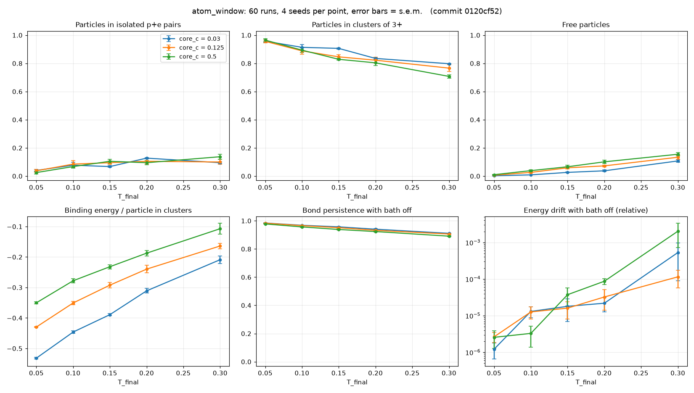

# atom_window: findings

Config: `experiments/atom_window.toml` · 60 runs (5 temperatures × 3 core
strengths × 4 seeds) · commit `0120cf5` · 21.5 min on 4 cores.
Tables: `summary.csv` (mean / std / s.e.m. per point), `results.csv` (one row per run).

## Hypothesis (written before the run)

Isolated p+e pairs sit in a deep well, while pairs attract each other only
through a weaker dipole-dipole force. So an intermediate temperature should
exist where pairs bind but do not stick together: an "atomic gas" between
the cold ionic solid and the hot plasma.

## Result: not supported in this range

| | T = 0.05 | T = 0.3 |
|---|---|---|
| particles in clusters of 3+ (chains) | 96% | 71–80% |
| particles in isolated p+e pairs | 2–4% | 10–14% |
| free particles | ≤1% | 11–15% |

- Chains dominate at every temperature and core strength tested. The atom
  fraction never exceeds 14%, while chains never drop below 71%.
- On heating, chains lose particles to free particles and to atoms at about
  the same rate. The system moves from ionic solid toward plasma without
  passing through an atom-dominated state.
- Core strength shifts every curve in the direction scaling predicts: a
  softer core (larger c, larger well radius r0 = (8c)^(1/7)) means
  shallower binding and more free particles at the same T.
- Structures are stable on their own: 89–98% of bonds persist between log
  frames after the bath is switched off.

## Why the hypothesis failed (likely)

The dipole-dipole attraction is not weak compared with pair binding. For an
alternating +/− chain, the Coulomb energy per ion pair is about
−2 ln 2 / r0 ≈ −1.39 / r0 versus −1 / r0 for an isolated pair. Adding a pair
to a chain therefore gains roughly 40% of an atom's binding energy. That is
too large a fraction to leave a clean temperature window at this density
(200 particles in a 30 × 30 box).

## Numerical caveat

Isolated-phase energy drift grows with temperature, reaching 1e-4 to 2e-3
at T = 0.3, and the monitor raised energy-drift flags in some T = 0.3 runs
(0.8 per run on average at c = 0.5). Hot particles approach closer, where the
1/r^8 core is stiff. The T = 0.3 numbers are still usable, but hotter sweeps
should use a smaller `dt`.

## Suggested next experiment

Sweep density (box size) together with temperature over a wider range
(T up to ~1.0, smaller dt). Chain growth needs pairs to meet, so at low
density an atomic-gas window may open. If it does not appear even there,
that points to a missing rule rather than a missing parameter choice.
