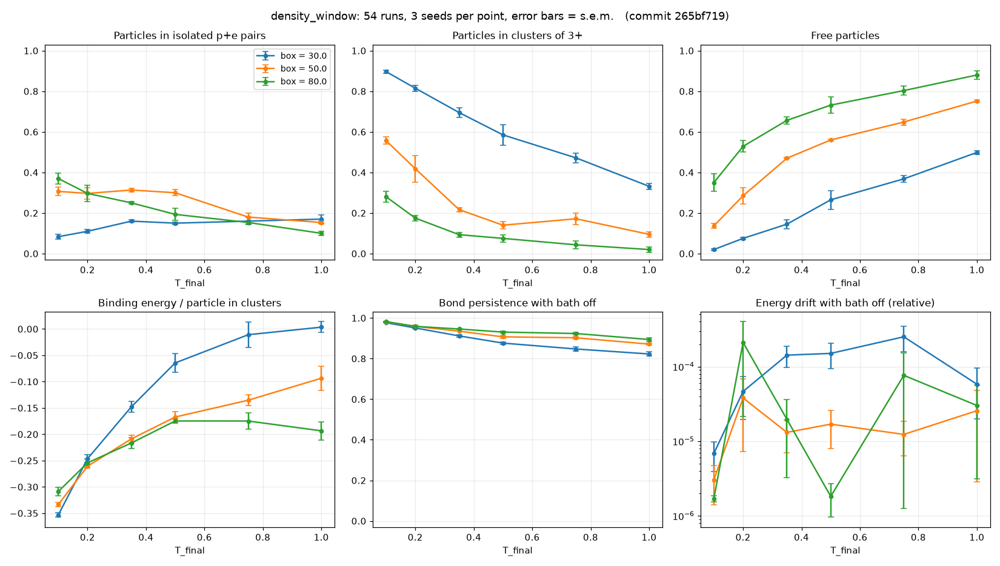

# density_window: findings

Config: `experiments/density_window.toml` · 54 runs (6 temperatures × 3
densities × 3 seeds) · commit `265bf71` · 33 min on 4 cores.
Tables: `summary.csv`, `results.csv`. Density ρ = 200 / box².

## Hypothesis (written before the run)

Chains grow only when bound pairs meet, and meetings get rarer as density
drops. So at low density there should be a temperature range where isolated
p+e pairs are the majority outcome.

## Result: partly supported

**Supported: density decides between chains and atoms.** At T = 0.1, the
share of particles in chains falls from 90% (ρ = 0.22) to 56% (ρ = 0.08) to
28% (ρ = 0.031). At the two lower densities, atoms outnumber chains over
most of the temperature range:

| ρ (box) | T range where atoms > chains | best atom fraction |
|---|---|---|
| 0.22 (30) | none | 17 ± 2% |
| 0.08 (50) | 0.35 to 0.75 | 31 ± 1% (T = 0.35) |
| 0.031 (80) | all T tested (0.1 to 1.0) | 37 ± 3% (T = 0.1) |

**Not supported: atoms never become the majority.** The atom fraction tops
out at 37%. Lowering density suppresses chains, but it also leaves more
particles free: any association (pair joining pair, or particle joining
particle) needs an encounter, and at low density an unbound state has much
more room, so it gains entropy. Between chains and free particles, atoms
are the most common bound structure at low density, but free particles are
the plurality above T ≈ 0.2.

## Caveat: the low-density, low-temperature corner had not settled

A new metric, `settle_free_change` (change in free fraction over the second
half of the hold), shows these points were still binding when the bath was
switched off:

| point | free fraction during hold (start → mid → end) | atoms during hold |
|---|---|---|
| box 80, T = 0.1 | 0.60 → 0.47 → 0.39 | 0.28 → 0.41 |
| box 80, T = 0.2 | 0.69 → 0.60 → 0.56 | 0.27 → 0.37 |
| box 50, T = 0.1 | 0.33 → 0.20 → 0.14 | 0.28 → 0.31 |

Settled points change by less than about ±0.03, which is the noise level;
these three changed by −0.05 to −0.08 in the last half of the hold. Their
atom fractions are therefore lower bounds. Whether atoms become the majority
at low density and low temperature is still open. This corner is exactly
where the hypothesis predicted a window, so the question needs a longer run
before it can be called either way.

The metric was added to the runner after this sweep; the values above were
computed from this sweep's per-run logs with the same function
(`emergent.experiment.settle_free_change`). Future sweeps report it
directly.

## Numerics

With dt = 0.0015, isolated-phase energy drift stayed at or below 3e-4 at all
points, up to T = 1.0, with no singularity flags. The box-30 column
reproduces atom_window at the matching points (chains 90% vs 89% at T = 0.1).

## Suggested next experiment

Approach equilibrium from both sides for the unsettled corner (box 50–80,
T 0.1–0.2): run each point once from the usual dissociated start and once
from a start where every particle is already paired into an atom, with a
much longer hold. If both starts converge to the same atom fraction, that
fraction is the equilibrium answer. This needs one small runner addition:
an option to start from pre-formed pairs.
