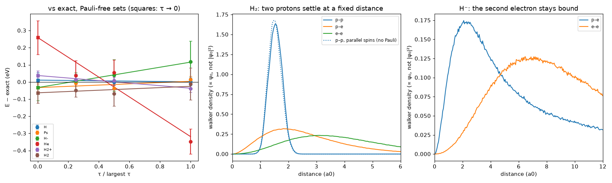

# diffusion: findings

Script: `run_diffusion.py` · rerun on branch `phase5-antisymmetry` with the
population-control correction (first run: PR #7, `0df78d6`) · 88 runs, 16 min
on 4 cores. Data: `chunks.csv` (every run), `summary.json` (extrapolations,
pair-distance histograms). Figure: `python plot_diffusion.py`. Units: atomic
units, real masses.

## Why this step

Phase 3 (`results/wavepacket/FINDINGS.md`) left two holes, both caused by
assuming something about the wave: one Gaussian per particle made atoms
19–23% underbound, and independent clouds could not bind H⁻ (no
correlation). This step assumes nothing about the wave.

## Rules (`emergent/diffusion.py`), identical for every particle

The Schrödinger equation in imaginary time is a diffusion equation, so it
can be run with random walkers. Each walker is one configuration of *all*
particles, nuclei included.

1. **Diffusion.** Every particle takes a random step with diffusion constant
   ħ/2m. Light particles spread fast, heavy ones slowly.
2. **Branching.** A configuration is copied or removed with weight
   exp(−τ[V − E_ref]), where V is its Coulomb energy.

Constants: ħ, masses, charges. E_ref only holds the walker count near 2000.
τ is a numerical step, run at three values and extrapolated to zero. Every
particle of every walker starts at an independent random point; nothing is
placed near anything.

**Declared before running:** for particle sets with no two identical
same-spin fermions this is the exact non-relativistic ground state, so it is
compared with exact literature values for the same particles and masses.
The walkers carry no antisymmetry, so for H₂ with parallel spins and for
lithium the rules must give a state the Pauli principle forbids. Those two
were run to measure that gap.

## Results

Energies extrapolated to τ → 0, compared with exact values for the same
Hamiltonian:

| system | diffusion (Hartree) | exact | difference |
|---|---|---|---|
| H | −0.4993 ± 0.0016 | −0.49973 | 0.2σ |
| Ps (e⁺e⁻) | −0.2512 ± 0.0008 | −0.25 | 1.5σ |
| H⁻ | −0.5287 ± 0.0028 | −0.52745 | 0.4σ |
| He | −2.8938 ± 0.0036 | −2.90330 | 2.6σ (see time step below) |
| H₂⁺ | −0.5958 ± 0.0010 | −0.59714 | 1.4σ |
| H₂ | −1.1664 ± 0.0022 | −1.16403 | 1.0σ |

Derived quantities compared with measurement, and with Phase 3:

| quantity (eV) | Phase 3 wave packets | **Phase 4 diffusion** | measured |
|---|---|---|---|
| H ionization | 11.03 | **13.59 ± 0.04** | 13.598 |
| He binding (both electrons) | 61.5 | **78.74 ± 0.10** | 79.005 |
| Ps binding | not run | **6.84 ± 0.02** | 6.80 |
| H⁻ electron affinity | unbound | **0.80 ± 0.09** | 0.754 |
| H₂⁺ bond, D₀ | not run | **2.62 ± 0.05** | 2.651 |
| H₂ bond, D₀ | (Dₑ 2.61) | **4.56 ± 0.11** | 4.478 |
| H₂ with parallel spins | unbound ✓ | **bound 4.65 ± 0.13** ✗ | unbound |
| Li (3 electrons) | ionization 5.31 ✓ | **−8.65 Hartree** ✗ | −7.4775 |

D₀ is the bond energy measured from the lowest vibrational level. The
protons here are quantum particles too, so their zero-point motion is
included automatically, and D₀ can be compared with experiment directly.

### What emerged

- **Exact atoms from two rules.** Hydrogen comes out at 13.59 ± 0.04 eV
  and helium at 78.7 eV (measured 79.0), with no shape assumed and nothing
  fitted. The Phase 3 shape limit (19–23% underbinding) is gone.
- **H⁻ binds.** A second electron stays attached to hydrogen by 0.80 ±
  0.09 eV (measured 0.754). This is correlation: the two electrons avoid
  each other moment to moment. The e–e distance peaks near 7 a0, while
  each electron stays near the proton (right panel). Independent clouds
  (Phase 3) and Hartree–Fock theory cannot produce this.
- **Chemical bonds with zero-point motion.** H₂ binds by 4.56 ± 0.11 eV
  (measured 4.478) and H₂⁺ by 2.62 ± 0.05 eV (2.651). The two protons, which
  started at random points, settle at a fixed separation: the walker
  distribution peaks at 1.53 a0 (middle panel; real equilibrium 1.40 a0).
  These walkers are distributed as ψ₀, not |ψ₀|², which shifts and widens
  the peak, so 1.53 a0 is not a measured bond length.
- **Positronium** (an electron and a positron, equal masses) binds at
  6.84 eV (6.80), with the same rules and no special case.

### What the diffusion rules get wrong: Pauli

- **H₂ with parallel spins binds**, with 4.65 eV and the same proton
  distance as ordinary H₂ (dotted line, middle panel). In reality it falls
  apart. The wave-packet rules got this right.
- **Lithium collapses to one shell:** −8.65 Hartree against the real
  −7.4775, so it is overbound by about 32 eV. With no antisymmetry, the third
  electron joins the other two in the innermost region.

So the diffusion rules are complete for everything with at most one
electron per spin (H, H⁻, He, H₂⁺, H₂, Ps). They are missing antisymmetry,
which Phase 3 had. The missing rule is known: identical fermions change the
sign of the wave when exchanged (Phase 5, `results/antisymmetry/`).

## Robustness notes (principle 4)

- **Population-control bias (found in Phase 5, corrected here).** Holding
  the walker count steady with E_ref biases the energy by an amount that
  shrinks as 1/(walker count). Near a nucleus, unguided weights swing so
  much that the effect is large: Li⁺ gave −7.208, −7.25 and −7.288 Hartree
  with 500, 2000 and 8000 walkers (exact −7.279). The first run of this
  experiment carried that bias: 5 of 6 energies sat slightly above exact.
  The estimator now undoes the E_ref factors over a trailing 3 a.u. window
  (Umrigar, Nightingale & Runge 1993). After correction the six energies
  scatter on both sides of exact (−1.5σ to +2.6σ).
- **Time step.** τ ∈ {0.02, 0.01, 0.005}/c², where c is the largest |qᵢqⱼ|.
  For helium, the largest τ is off (−2.9161) while the two smaller ones
  agree with exact (−2.9013 ± 0.0027, −2.9019 ± 0.0031; exact −2.9033). A
  straight line through all three therefore overshoots to −2.8938. The τ
  dependence is not linear at the largest step; the smallest steps are the
  better estimate. All other systems fit a line well (χ² ≤ 3 for one degree
  of freedom).
- **Errors.** Errors from blocks within one run are too small (the halves of
  one run differ by 2–5 block errors). The quoted errors use the spread
  between 4 independent runs (different seeds) wherever it is larger. With
  only 4 runs, the error bars are themselves uncertain by roughly ±40%.
- **Branching cap.** At most 4 copies per step. The cap was reached in fewer
  than 2 × 10⁻⁶ of branching events.
- **Heavy particles equilibrate slowly.** A proton's random walk covers 43×
  less distance than an electron's in the same time, so H₂ and H₂⁺ runs
  equilibrate for 60–100 a.u. The proton distributions from the full runs
  (4 seeds pooled) are smooth; short test runs with 10 a.u. of
  equilibration were visibly lumpy.

## What this means for the project

This is the first rule set in the project that contains no approximation
of the physics it claims to model: two rules, three kinds of constants, and
for Pauli-free particle sets the answer is the exact non-relativistic one.
Atoms, the negative ion, a one-electron bond, the covalent bond and
positronium all emerge, each within 2.6 standard errors of exact. Every
earlier "hole" in that class is closed.

What remains is the Pauli principle. Phase 3 had it and lacked
correlation; Phase 4 has correlation and lacks Pauli. The next rule is
antisymmetry expressed in the walk itself.
