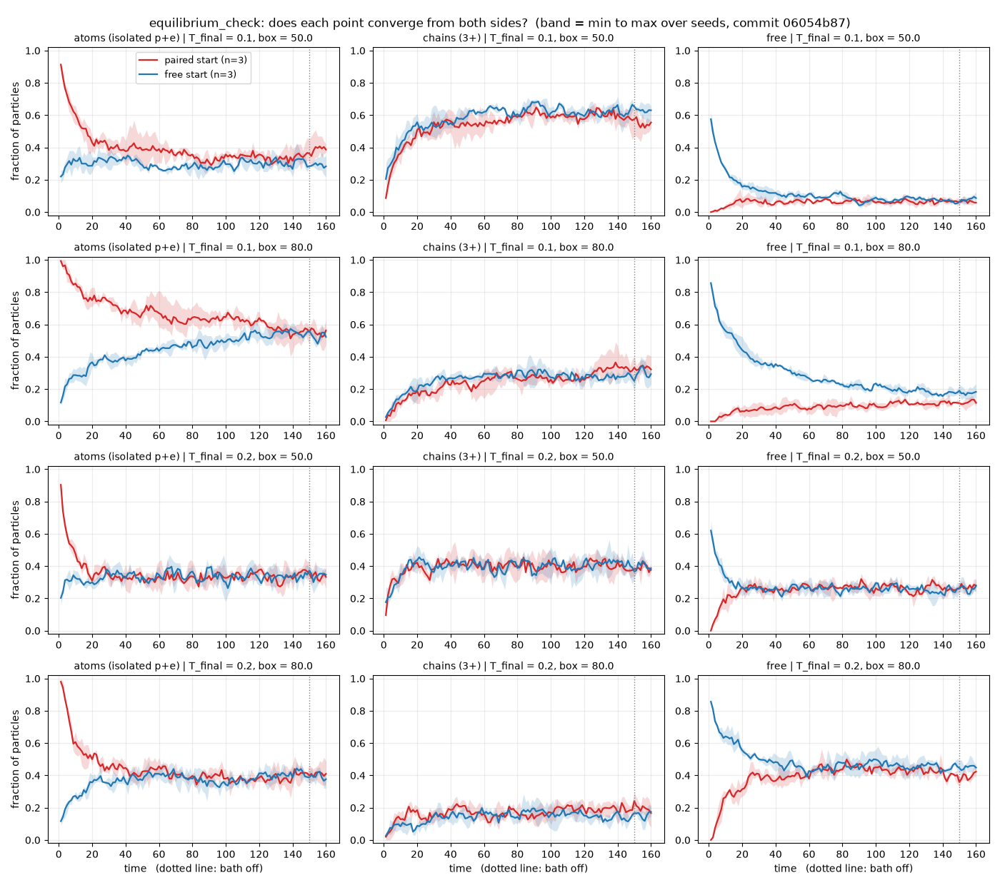

# equilibrium_check: findings

Config: `experiments/equilibrium_check.toml` · 24 runs (2 temperatures × 2
densities × 2 starts × 3 seeds) · commit `06054b8` · 23 min on 4 cores.
Hold 150 time units at the target temperature (about 10× density_window's),
then 10 time units with the bath off.

## Question

density_window left the low-density, low-temperature corner unsettled, so
its atom fractions there were only lower bounds. Once the system settles, do
atoms become the majority?

## Method

Each point was run from two opposite starts: every particle free
(`init = "random"`) and every particle already paired into an atom
(`init = "pairs"`). The free start can only gain atoms; the paired start can
only lose them. Where both reach the same fractions, that is the
equilibrium. Where they are still approaching each other, equilibrium lies
between them.

## Result: yes, at the lowest density and T = 0.1

Averages over the late hold (t = 100 to 150), mean over 3 seeds:

| T | ρ (box) | start | atoms | chains | free | settled? |
|---|---|---|---|---|---|---|
| 0.1 | 0.031 (80) | free | 0.53 | 0.28 | 0.19 | approaching |
| 0.1 | 0.031 (80) | paired | 0.59 | 0.30 | 0.11 | approaching |
| 0.1 | 0.08 (50) | free | 0.30 | 0.62 | 0.08 | yes |
| 0.1 | 0.08 (50) | paired | 0.34 | 0.60 | 0.06 | yes |
| 0.2 | 0.031 (80) | free | 0.39 | 0.15 | 0.46 | yes |
| 0.2 | 0.031 (80) | paired | 0.38 | 0.19 | 0.42 | yes |
| 0.2 | 0.08 (50) | free | 0.33 | 0.41 | 0.26 | yes |
| 0.2 | 0.08 (50) | paired | 0.34 | 0.40 | 0.26 | yes |

- **ρ = 0.031, T = 0.1: atoms are the majority.** The two starts are still
  closing in on each other (atoms rising from one side, falling from the
  other), but both are already above half: 53% and 59%. The equilibrium
  atom fraction is therefore between about 0.53 and 0.59. This is the first
  state in the project where isolated atoms are the most common outcome.
- **The window is narrow.** Doubling the temperature at the same density
  drops atoms to 38–39%, with free particles (42–46%) now the largest group.
  At ρ = 0.08 and T = 0.1, chains dominate (60–62%), with atoms at 30–34%.
- **The other three points are settled.** Both starts agree within a few
  percent, so those values are equilibrium results, not artefacts of the
  starting state.

So the original atom_window hypothesis holds only in a restricted form: an
atom-dominated regime exists, but it needs both low density and low
temperature. Raising density lets atoms join into chains; raising
temperature lets them break apart into free particles.

## Corrections to density_window

density_window's numbers in this corner were lower bounds, as flagged there.
The settled values are:

| point | density_window atoms | settled atoms |
|---|---|---|
| ρ = 0.031, T = 0.1 | 0.37 | 0.53–0.59 |
| ρ = 0.031, T = 0.2 | 0.30 | 0.38–0.39 |
| ρ = 0.08, T = 0.1 | 0.31 | 0.30–0.34 (unchanged) |

## Numerics

Isolated-phase energy drift ≤ 4e-5 at every point, no anomaly flags.

## Open items

- ρ = 0.031, T = 0.1 had not fully settled after 150 time units (free
  fraction 0.11 vs 0.19 between starts). A longer hold would pin the atom
  fraction down more tightly, but it cannot move it below the free start's
  0.53 if the curves keep closing monotonically, as they do in the plot.
- Only two temperatures were tested at low density. The full shape of the
  atom-majority region (how far down in density and up in temperature it
  extends) is the natural next map.
