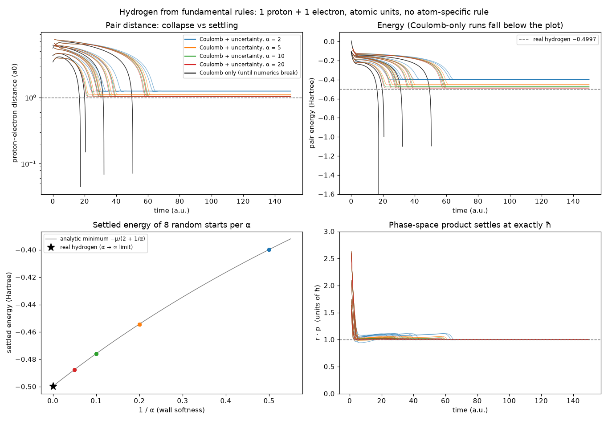

# hydrogen_emergence: findings

Script: `run_hydrogen.py` · commit `c634cfe` · 9.4 min on 4 cores.
Data: `results.csv`, `universality.csv`, `series.json`, `provenance.json`.
Units: atomic units (ħ = e = m_e = 1), real proton mass 1836.15.

## Question

Phase 1 showed that Coulomb's law plus a hand-chosen short-range core gives
bound pairs whose size and energy come from that hand-chosen constant. Is
there a single *fundamental* rule that, added to Coulomb's law, makes real
hydrogen emerge, with no constant tuned to atoms? (See `PRINCIPLES.md`.)

## Rules used

| Rule | Form | Constants |
|---|---|---|
| Coulomb | k q_i q_j / r, every pair | k = 1 (atomic units) |
| UncertaintyCore | phase-space wall: r · p_rel ≥ ξħ, every pair | ξ = 1, ħ = 1, fixed before any run; α = wall stiffness (numerical) |
| Friction | −γ q̇ on every particle | stands in for radiation; only removes energy |

No rule refers to atoms. `CoreRepulsion` is not used.

## Results

**A. Coulomb only: collapse.** In all 4 runs the electron spirals in and
the pair energy falls through −1 Hartree (one run reached −22) with no floor,
until the integrator can no longer follow the diverging force. The simulator
flags this as a breakdown instead of reporting nonsense. This is the
classical-atom collapse that forced physics to invent quantum mechanics.

**B. Coulomb + UncertaintyCore: one ground state, from any start.** All 8
random starts at each wall stiffness settle into the same state, with r · p
= 1.00000 ħ. Settled energies match the analytic minimum of the model,
−μ/(2 + 1/α), to about 1e-7 Hartree, and approach real hydrogen as the wall
hardens:

| α | settled energy (Hartree) | settled radius (a0) |
|---|---|---|
| 2 | −0.39978 | 1.250 |
| 5 | −0.45430 | 1.100 |
| 10 | −0.47593 | 1.050 |
| 20 | −0.48754 | 1.025 |
| α → ∞ (analytic limit) | **−0.49973** | **1.0005** |
| real hydrogen (reduced mass) | −0.49973 (13.598 eV) | 1.0005 |

**C. Stable.** A settled atom kicked by 10% of its momentum, with friction
off, stays bound with radius 1.01–1.09 a0 for 100 a.u.; energy drift 3e-12.

**D. Numerics.** Halving dt changes the settled energy by less than 1e-8.

**E. Universality: same rule, other systems, no new constants.**

| system | predicted binding (α → ∞) | measured | error |
|---|---|---|---|
| hydrogen | 13.594 eV | 13.598 eV | −0.03% |
| He⁺ (nuclear charge 2) | 54.399 eV | 54.418 eV | −0.03% |
| positronium (e⁺ e⁻, equal masses) | 6.801 eV | 6.80 eV | +0.01% |

The remaining ~0.03% is the expected error of the two-point extrapolation
in 1/α (the error term is of order 1/(α₁α₂) ≈ 3e-4), not a physics
mismatch. Seed spread and dt sensitivity are below 1e-6 eV.

## What this means

Adding one universal rule, "no pair can have distance × relative momentum
below ħ", turns a collapsing system into one that predicts the measured
ground-state energies of three different two-body systems to within the
extrapolation error, with nothing fitted. In the project's terms, the
missing fundamental rule behind the Phase 1 mismatch is (a classical form
of) the uncertainty principle.

## Limits: what this does *not* show

- **ξ = 1 is a choice, not a derivation.** It is the natural value (one de
  Broglie wavelength around the orbit, 2πr = h/p, gives r · p = ħ), and it
  was fixed before any run. But the simulation does not derive it. ξ = 1/2,
  for example, would predict energies 4× too deep. The universality test is
  what supports it: one value works for three different systems.
- **The atom is a point in phase space, not a cloud.** The electron settles
  at a fixed distance with zero velocity but nonzero momentum. Real hydrogen
  has a probability cloud with average distance 1.5 a0; the model's radius
  matches the Bohr radius (the most probable distance), not the average.
- **No excited states or spectral lines.** The model reproduces the ground
  state only.
- **Only one electron per system.** Multi-electron atoms, molecules (H₂)
  and why H₃ does not form need a second rule: Pauli exclusion, which needs
  spin. That is the next test, and a harder one: Kirschbaum and Wilets had
  to fit their Pauli constant to atoms, which our principles do not allow.
- **Energies are relative to a free pair at rest.** Relativistic and QED
  corrections (≈1e-5 relative for hydrogen) are outside the model and below
  the extrapolation error here.

## Suggested next step

Add spin as a particle property and a Pauli rule for same-spin pairs, with
its constant fixed from a system that is not an atom (the Fermi-gas
calibration of Dorso, Duarte and Randrup, Phys. Lett. B 188, 1987). Then
test, without further changes: does H₂ bind? Does H₃ fail to bind? Does
helium's ground state come out near 79.0 eV total binding?
