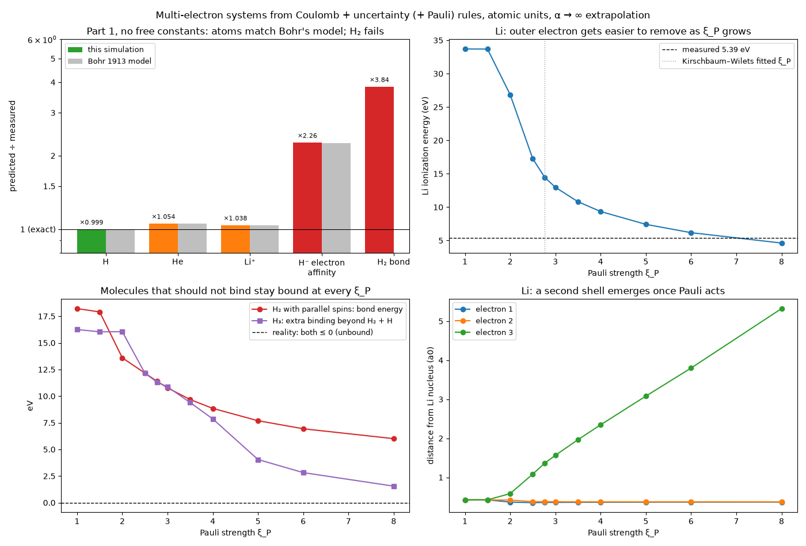

# multielectron: findings

Script: `run_multielectron.py` · commit `746ffa2` · 38 ground-state searches, ~3 min on 4 cores.
Data: `results.csv`, `provenance.json` (commit and measured reference values).
Units: atomic units, real nuclear masses (He-4 nucleus is a boson, the others
fermions).

## Questions

1. Does the uncertainty rule that gave exact one-electron atoms
   (`results/hydrogen_emergence/`) still work with several electrons and
   several nuclei, with no new constants?
2. Can a Pauli rule with **one** universal strength ξ_P make lithium, H₂
   with parallel spins and H₃ all come out right?

## Rules

| Rule | Acts on | Constant |
|---|---|---|
| Coulomb | every pair | none |
| UncertaintyCore, r · p ≥ ħ | every pair | ξ = 1, fixed |
| PauliCore, r · p ≥ ξ_P ħ | identical fermions with the same spin | ξ_P, scanned 1 to 8 |

Ground states are the lowest minimum of H(q, p) over 16 random starts per
atom and 32 per molecule, at wall stiffness α = 5, 10, 20, 40, extrapolated
to α → ∞. The minimizer finds the same states as friction dynamics
(`tests/test_groundstate.py`).

## Part 1: no free constants (no same-spin electrons, so Pauli cannot act)

| quantity | predicted | measured | error | Bohr's 1913 model |
|---|---|---|---|---|
| H binding | 13.590 eV | 13.598 eV | −0.1% | 13.606 eV |
| He total binding | 83.279 eV | 79.005 eV | +5.4% | 83.335 eV |
| Li⁺ total binding | 205.716 eV | 198.094 eV | +3.8% | 205.786 eV |
| H⁻ electron affinity | 1.707 eV | 0.754 eV | +126% | 1.701 eV |
| H₂ bond energy | 18.215 eV | 4.747 eV | +284% | (Bohr: underbound) |
| H₂ bond length | 1.118 a0 | 1.401 a0 | −20% | |

**Atoms reproduce Bohr's old quantum theory, digit for digit.** In every
two-electron atom the electrons settle on opposite sides of one orbit, and
the energy is Bohr's E = −(Z − ¼)² Hartree (differences are the reduced
mass and extrapolation). That model is known to overbind helium by about
5%, and this failure was one of the reasons physics moved from orbits to
wave mechanics in 1925–26. The rules have independently arrived at the
same place, and the same wrong answer.

**Molecules fail badly.** H₂ is bound almost 4× too strongly and 20% too
short. The geometry shows why: the two electrons circle the axis between the
protons on a ring of radius 0.56 a0, each 0.79 a0 from both protons. The
rule asks only that each electron's *distance to each proton* times momentum
is at least ħ. The uncertainty principle is really about the electron's *own*
confinement, here the 0.56 a0 ring. In a one-nucleus atom the two distances
are the same thing, so hydrogen and helium work. With two nuclei they come
apart, the rule under-charges for squeezing the electrons, and the molecule
overbinds.

This is the first clear hole the project has found in its own rules: **a
pairwise phase-space wall is a two-body stand-in for a one-body quantity
(each particle's spatial spread), and that stand-in breaks as soon as a
particle is shared between two centres.**

## Part 2: the Pauli map

| ξ_P | Li ionization (eV) | H₂ parallel-spin bond (eV) | H₃ binding beyond H₂ + H (eV) | Li outer electron (a0) |
|---|---|---|---|---|
| 1 | 33.70 | 18.22 | 16.25 | 0.42 (no shell) |
| 2 | 26.87 | 13.60 | 16.05 | 0.58 |
| 2.767 (KW fitted) | 14.43 | 11.40 | 11.32 | 1.37 |
| 4 | 9.35 | 8.85 | 7.86 | 2.35 |
| 6 | 6.18 | 6.94 | 2.82 | 3.80 |
| 8 | 4.62 | 6.01 | 1.55 | 5.32 |
| **measured** | **5.39** | **unbound (≤ 0)** | **unbound (≤ 0)** | 3.87 (average of real 2s) |

- **Shells emerge from the Pauli rule.** From ξ_P ≈ 2.5 up, lithium's third
  electron (the one sharing a spin with another) moves out, while the other
  two stay at 0.36 a0. The rule never mentions shells.
- **Lithium alone would pick ξ_P ≈ 7.** That is where the ionization energy
  crosses the measured 5.39 eV, with the outer electron at about 4.5 a0.
- **No single ξ_P works.** At ξ_P ≈ 7, H₂ with parallel spins is still bound
  by about 6.5 eV and H₃ by about 2 eV; in reality both are unbound. Both
  curves fall as ξ_P grows but never reach zero in the range scanned,
  because the Part 1 molecule overbinding sits underneath them.

**Verdict:** on top of the current uncertainty rule, the Pauli strength
cannot be a universal constant. Fitting it to lithium would hide the real
problem, so we do not adopt a value.

## Robustness notes

- At α = 40 every start reached the lowest energy for all atoms (16 of 16).
  For H₂ with opposite spins 23 of 32 starts did; for H₂ with parallel spins
  3 to 32 of 32 depending on ξ_P; for H₃ only 1 to 11 of 32. H₃'s landscape
  is rugged, so its true minimum could lie lower still; that would only
  strengthen "H₃ is wrongly bound".
- Some starts hit the minimizer's iteration cap (counted per system in
  `results.csv`, columns `capped_a*`). The cap mostly marks slow final
  convergence along flat directions: for Li⁺, 7 of 16 starts were capped
  and all 16 still reached the same lowest energy.
- Energies are extrapolated linearly in 1/α from α = 20 and 40; for the
  one-electron case this extrapolation was accurate to 0.03%.

## What the next fundamental rule should be

The hole points to its own fix: **give every particle its own spatial
spread as a degree of freedom**, a wave-packet width s with its conjugate
momentum, instead of a pairwise wall. Confining a particle then costs
kinetic energy of order ħ²/(m s²) no matter how many partners it has, and
Coulomb forces between spread-out particles soften at short range. This is
the step from Bohr's orbits to wave mechanics. The electron force field of
Su & Goddard (Phys. Rev. Lett. 99, 185003, 2007) is a worked example of
this idea; its Pauli correction contains fitted constants, which our
principles would have to address separately.

Prediction to test: with a per-particle width rule, H₂ should stop
overbinding. Whether H₂ with parallel spins and H₃ then come out unbound,
and whether one Pauli strength then fits everything, is the real test.
