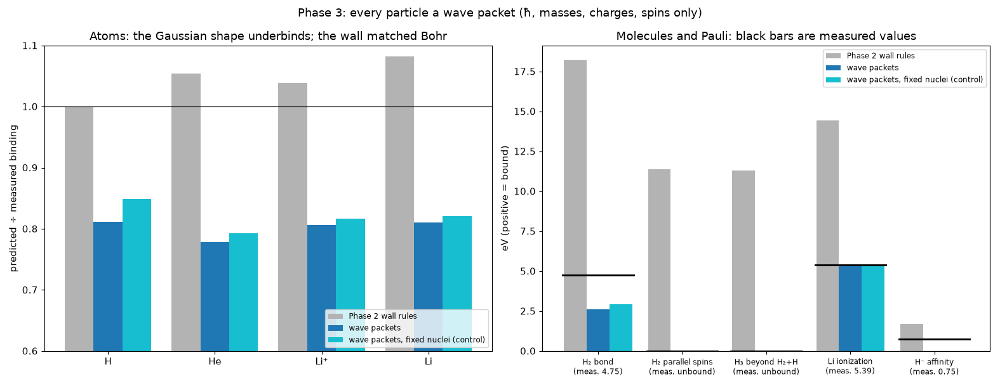

# wavepacket: findings

Script: `run_wavepacket.py` · commit `e80d6f5` · 18 ground-state searches, ~4 min on 4 cores.
Data: `results.csv`, `provenance.json`. Units: atomic units, real masses.

## Why this step

Phase 2 exposed a hole (`results/multielectron/FINDINGS.md`): the pairwise
uncertainty wall measured each electron's distance to each nucleus instead
of the electron's own spread, so H₂ overbound 3.8×. And the Pauli wall had a
strength that could not be made universal.

## Rules (`emergent/wavepacket.py`), identical for every particle

1. Every particle is a Gaussian wave of width s. Confining it costs
   3ħ²/(2ms²). The uncertainty principle now follows from this (Δx·Δp = ħ/2
   for a Gaussian) instead of being a separate rule.
2. Coulomb acts between the particles' charge clouds.
3. Identical fermions with the same spin are antisymmetric (a Slater
   determinant). This is the quantum Pauli rule itself, with **no strength
   to choose**.

Constants: ħ, masses, charges, spins. Every particle, nucleus or electron,
starts at a random point with a random width; nothing is placed near
anything, and no rule mentions atoms, shells or bonds.

**Declared before running:** one Gaussian per particle is a restricted wave
shape, which underbinds atoms (single-Gaussian hydrogen is −0.4244 Hartree,
not −0.5).

## Results

| quantity | Phase 2 wall | **wave packets** | fixed-nuclei control | measured |
|---|---|---|---|---|
| H₂ bond | 18.2 eV | **2.61 eV** | 2.92 eV | 4.75 eV |
| H₂ bond length | 1.12 a0 | **1.55 a0** | 1.47 a0 | 1.40 a0 |
| H₂ with parallel spins | bound 11.4 eV | **unbound** | unbound | unbound |
| H₃ beyond H₂ + H | bound 11.3 eV | **unbound** | unbound | unbound |
| He₂ | not tested | **unbound** | unbound | unbound (0.001 eV, van der Waals) |
| Li ionization | 14.4 eV | **5.31 eV** | 5.33 eV | 5.39 eV |
| H⁻ electron affinity | 1.71 eV | **0 (unbound)** | 0 | 0.75 eV |
| H binding | 13.59 eV | **11.03 eV** | 11.55 eV | 13.60 eV |
| He binding | 83.3 eV | **61.5 eV** | 62.6 eV | 79.0 eV |
| Li binding | 220.1 eV | **164.9 eV** | 167.1 eV | 203.5 eV |

(Phase 2 Pauli values are at ξ_P = 2.767, the Kirschbaum–Wilets value; no
single ξ_P fixed them, see `results/multielectron/FINDINGS.md`.)

### What emerged

- **A covalent bond.** In H₂ both electrons settle at the midpoint between
  the protons in one shared cloud. The bond now *under*binds (2.6 eV vs
  4.75) instead of overbinding 3.8×, and the bond length is 11% long
  instead of 20% short.
- **The Pauli principle works with no constant.** H₂ with parallel spins
  separates (atoms end 10 a0 apart), H₃ splits into H₂ + H, and He₂ does
  not bind. In Phase 2, no Pauli strength achieved any of these.
- **Shells.** Lithium's two opposite-spin electrons form a tight cloud
  (width 0.71 a0); the third, sharing a spin with one of them, is forced
  into a wide cloud (width 4.75 a0, rms radius 4.1 a0; real 2s ≈ 4.4 a0).
  Its ionization energy, **5.31 eV vs 5.39 measured**, emerges with zero
  constants. Part of this accuracy is likely cancellation: Li and Li⁺ are
  each underbound by about 38 eV, and the difference comes out right.

### What got worse, and why

- **Absolute atomic energies are 19–23% too weak.** This is the declared
  Gaussian-shape limit: the fixed-nuclei control reproduces hydrogen at
  exactly −4/(3π) Hartree (11.549 eV) and helium at the analytic
  single-Gaussian value (−2.3010 Hartree). The Phase 2 wall matched Bohr's
  model better on absolute atom energies, but for the wrong reason: it was
  built around r·p = ħ, which happens to be exact for hydrogen.
- **Nuclei as independent packets cost an extra ~0.5 eV per nucleus**
  (main run vs control). A proton has to localize itself on its own, which
  a real atom, free to move as a whole, does not. This is an artefact of
  treating particles as independent (product) packets.
- **H⁻ does not bind.** Its second electron spreads out and leaves. Binding
  H⁻ needs electron *correlation* (the two electrons avoiding each other
  moment to moment), which one independent cloud per electron cannot
  describe. Hartree–Fock theory, the textbook version of this approximation,
  famously fails for H⁻ the same way.

## Robustness notes

- Every start reached the lowest energy for all atoms, H₂ (opposite spins)
  and He₂. For H₂ with parallel spins 23–25 of 32 starts did, for H₃ only
  5–10 of 32. No start found a lower, bound H₃ or bound parallel-spin H₂.
- H⁻'s escaping electron reached the width limit (1000 a0): it is free.
- Some starts hit the iteration cap (column `capped`); for Li 4–6 of 32,
  yet 31–32 of 32 still reached the lowest energy.

## What this means for the project

Replacing a pairwise stand-in with a property every particle carries (its
own spread), plus the real antisymmetry rule, fixed every qualitative
failure of Phase 2 with **fewer** constants (none besides ħ, masses, charges
and spins). What remains are the known limits of one Gaussian per particle:

1. **Shape**: a single Gaussian cannot be the exact wave. Letting each
   particle's wave take a freer shape (a sum of several Gaussians) is the
   systematic fix.
2. **Correlation**: independent clouds miss how particles avoid each other
   (H⁻, some of the H₂ bond). The exact rule has no independent clouds at
   all.

Both point the same way: the next step up is to stop approximating the
wave. One route that stays close to this project's spirit is
imaginary-time diffusion (diffusion Monte Carlo): particles random-walk
with diffusion constant ħ/2m and multiply or die according to the local
potential energy. It needs no assumed shape and no correlation model, and
it is exact for systems like He, H⁻ and H₂ whose ground state has no
sign changes.
